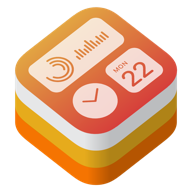
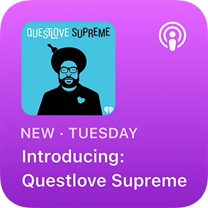
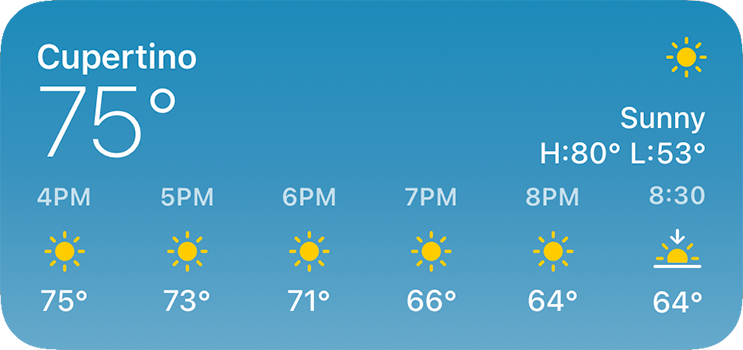
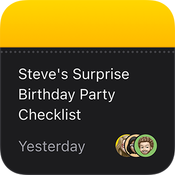

<h1 align="center">flutter_wk</h1>

<p align="center">
    
    
</p>

<div align="center">
  <strong><a href="https://flutter.dev/">Flutter</a> Library for the iOS 🍏 <a href="https://developer.apple.com/documentation/widgetkit/">WidgetKit framework</a> and Widget Communication</strong>
</div>
<br>
<div align="center">



</div>
<br>

## Table of Contents 📚

- [Introduction](#introduction-)
- [Installation](#installation-)
- [Usage](#usage-)
- [Documentation](#documentation)
- [Roadmap](docs/roadmap.md)
- [Methods](#methods-)
- [Contributing](CONTRIBUTING.md)
- [License](#license-)

## Description

This library allows you to call essential methods from the iOS "WidgetKit Framework", which are needed when developing a widget. For example updating the widget timelines. It is also possible to communicate with the widget via <a href="https://developer.apple.com/documentation/bundleresources/entitlements/com_apple_security_application-groups">App Groups</a>/<a href="https://developer.apple.com/documentation/foundation/userdefaults">UserDefaults</a>.

To be on the safe side: This library exposes API functionality of <a href="https://developer.apple.com/documentation/widgetkit/">WidgetKit</a>. The widgets themselves must be developed natively in SwiftUI.

### <strong><a href="https://thomas-leiter.medium.com/develop-an-ios-14-widget-in-flutter-with-swiftui-e98eaff2c606">Blog</a> about writing a Widget with this library</strong>

## Installation

Add flutter_wk as a <a href="https://flutter.dev/docs/development/packages-and-plugins/using-packages">dependency in your pubspec.yaml</a> file.

Then run `flutter pub get`.

## Usage

```dart
import 'package:flutter_wk/flutter_wk.dart';

const appGroup = 'group.com.example.widget';

// Reload widget timelines.
await WidgetKit.reloadAllTimelines();
await WidgetKit.reloadTimelines('example_widget');

// Communicate with the widget through an App Group.
await WidgetKit.setItem<String>('testString', 'Hello World', appGroup);
final value = await WidgetKit.getItem<String>('testString', appGroup);
await WidgetKit.removeItem('testString', appGroup);
```

### iOS setup notes

- Widgets still need to be implemented natively in SwiftUI.
- Configure the same App Group for the app target and the widget extension.
- The iOS package supports Swift Package Manager and CocoaPods.
- The plugin's iOS deployment target is iOS 13.0. WidgetKit APIs require iOS 14.0 or newer at runtime.

### Error handling

- `WidgetKit.getItem`, `WidgetKit.setItem`, and `WidgetKit.removeItem` throw a `PlatformException` with code `missing_app_group` when `appGroup` is empty.
- The same methods throw a `PlatformException` with code `invalid_app_group` when the provided App Group is not configured for the app.
- A missing key still returns `null`; only App Group configuration problems are surfaced as errors.

### Documentation

- [Architecture guide](docs/architecture.md)
- [Roadmap](docs/roadmap.md)
- [Widget setup guide](docs/widget_setup.md)
- [Widget troubleshooting guide](docs/widget_troubleshooting.md)


## Methods

#### `Future<void> WidgetKit.reloadAllTimelines()`

Reloads the timelines for all configured widgets belonging to the containing app.

---

#### `Future<void> WidgetKit.reloadTimelines(String ofKind)`

Reloads the timelines for all widgets of a particular kind.

---

#### `Future<T?> WidgetKit.setItem<T>(String key, Object? value, String appGroup)`

Writes Key-Value to <a href="https://developer.apple.com/documentation/foundation/userdefaults">UserDefaults</a> database.

Throws a `PlatformException` if the App Group is empty or invalid.

---

#### `Future<T?> WidgetKit.getItem<T>(String key, String appGroup)`

Reads Value from <a href="https://developer.apple.com/documentation/foundation/userdefaults">UserDefaults</a> database.

Throws a `PlatformException` if the App Group is empty or invalid.

---

#### `Future<bool> WidgetKit.removeItem(String key, String appGroup)`

Removes Value for Key from <a href="https://developer.apple.com/documentation/foundation/userdefaults">UserDefaults</a> database.

Throws a `PlatformException` if the App Group is empty or invalid.

---

## License

[MIT License](LICENSE)
