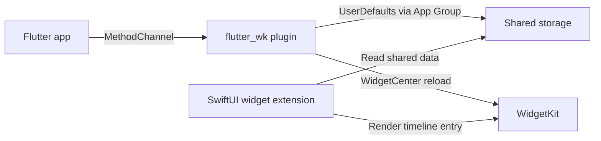

# Architecture Guide

`flutter_wk` is a bridge package.
It exposes a small Flutter API for iOS WidgetKit timeline reloads and App Group storage, while leaving widget rendering fully on the native SwiftUI side.

## Design goal

The package focuses on one responsibility:

- Flutter writes shared data and asks WidgetKit to reload.
- Native SwiftUI code reads the shared data and renders the widget.

That means `flutter_wk` is not a widget framework, not a Dart-driven style system, and not a generated SwiftUI layer.

## High-level flow

## Package layers

### 1. Flutter API layer

The public Dart API lives in `lib/flutter_wk.dart`.

It exposes only five operations:

- `reload()`
- `reloadOfKind(String kind)`
- `read<T>(String key, String appGroup)`
- `write<T>(String key, Object? value, String appGroup)`
- `remove(String key, String appGroup)`

This layer is intentionally narrow.

### 2. Native plugin layer

The iOS plugin implementation lives in `ios/flutter_wk/Sources/flutter_wk/FlutterWidgetkitPlugin.swift`.

It is responsible for:

- receiving MethodChannel calls
- validating the App Group
- writing and reading `UserDefaults`
- calling `WidgetCenter.reloadAllTimelines()`
- calling `WidgetCenter.reloadTimelines(ofKind:)`

The plugin does not build widget views.

### 3. App Group validation layer

App Group validation is isolated in `ios/flutter_wk/Sources/flutter_wk_core/FlutterWidgetkitGroupStore.swift`.

This layer centralizes the storage rules:

- empty App Group strings are rejected
- invalid App Group suites are rejected
- valid suites return shared `UserDefaults`

That separation keeps the plugin code simpler and makes native behavior easier to test.

### 4. Native widget extension layer

The widget extension is owned by the app, not by the plugin.

The example implementation lives in `example/ios/FlutterWidget/FlutterWidget.swift` and shows the expected native responsibilities:

- define the widget kind
- read from `UserDefaults(suiteName: ...)`
- decode the stored payload
- provide timeline entries
- render SwiftUI views

## Runtime contract

The package works when these two sides agree on the same contract:

- the same App Group ID
- the same storage key
- the same payload format
- the correct widget kind when reloading specific timelines

If any of those drift, the plugin can still work while the widget appears stale or empty.

## Error model

`flutter_wk` surfaces App Group issues explicitly.

- `missing_app_group`: the caller passed an empty App Group string
- `invalid_app_group`: no `UserDefaults` suite exists for the provided App Group
- `app_group_error`: an unexpected native resolution failure occurred

This keeps App Group misconfiguration visible instead of failing silently.

## Why the package stays small

The current architecture deliberately avoids:

- Dart-side widget rendering abstractions
- style systems for native views
- config trees unrelated to the bridge contract
- event channels without a real native event source

That tradeoff keeps the public API easier to reason about and easier to validate.

## Extension points

If the package grows, the safest direction is still incremental:

1. keep `WidgetKit` as the low-level API
2. add optional serialization helpers only where repeated app code justifies them
3. improve docs and examples before expanding abstractions

This preserves the main value of `flutter_wk`: a strict bridge between Flutter and native WidgetKit behavior.